# TRS User Guide

Access the [DLH Training Registration system](https://dlh.cloud.processmaker.net).

<!-- Contents  -->
## Contents 

### Part 1. [About the TRS ](#link-to-a-heading-in-the-page)

- [Scenarios ](#scenarios)
- [Terminology](#terminology)
- [Requests and Tasks](#requests-and-tasks)
- [Stages](#stages)
- [Interface: Views](interface-views)
- [Interface: Forms](#interface-forms)

### Part 2. Using the TRS [Link to a heading in the page](#link-to-a-heading-in-the-page)

- [Create an account](#create-and-account)
- [Create a training ](#create-a-training)
  - [Create Single Training](#create-a-single-training)
  - [Create Learning Track ](#create-a-learning-track)
- [Response](#response)

### Part 3. Guidance notes [Link to a heading in the page](#link-to-a-heading-in-the-page)

- for providing general training information [Link to a heading in the page](#link-to-a-heading-in-the-page)
- for including ESCO concepts [Link to a heading in the page](#link-to-a-heading-in-the-page)

<!-- 1.0 -->
# Part 1. About the TRS

<!-- 1.1 -->
## Scenarios

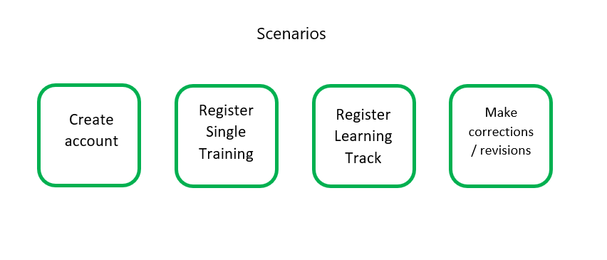

<!-- 1.2 -->
## Terminology

**Single Training**

A short course that may be delivered in one, or several sessions. Usually having a duration between 2 hours to 30 hours.

**Learning Track**

A sequence of complementary courses, with a duration between 30 and 100+ hours.

**Module**

A unit of training (a course) within a Learning Track.

**Request**

An instance of the registration process that is carried out in order to register a training.

**Task**

Opening, completing and submitting the forms needed to carry out the Request.  

<!-- 1.3 -->
## Requests and Tasks

Registering a training involves several processes, which are carried out in the context of Requests.

There are two kinds of Request you can do to register a training: 

1.	*CourseRegistration* for registering Learning Tracks.
2.	*ModuleRegistration* for registering Single Trainings.  

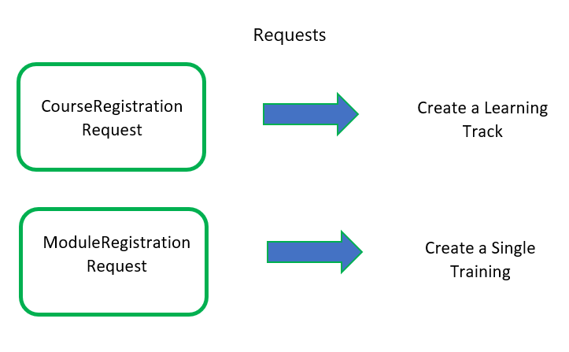

Completing a Request involves carrying out one, or several, Tasks. There are three kinds of Task: 

- *Select training type and Open LT Information Form*
- *Open the Training Information Form*
- *Open the Corrections Form*

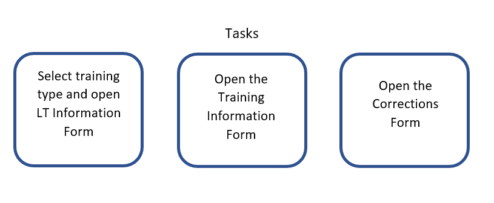

<!-- 1.4 -->
## Stages

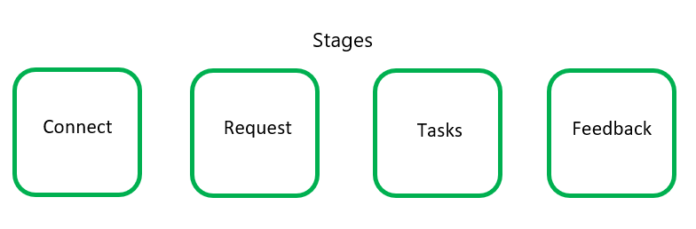

Stages of the overall training registration process: 

Stage 1. Connect. Create an account, or log in to your existing account

Stage 2. Request. Launch a new Request to register a training. 

Stage 3. Tasks. Open the Forms needed to provide information about your course(s).

Stage 4. Feedback. Get a response from the DLH Training Administration Team for  

- review and correction of your forms, or 

- approval and confirmation of your Request.

<!-- 1.5 -->
## Interface: Views

<!-- 1.5.1 -->
#### Dashboard

The entry point and main view of the Dashboard. The Dashboard displays a summary of your requests in three coloured areas : My Requests, In Progress, Completed.

<!-- 1.5.2 -->
#### Requests view

By default, the main view also displays the list of your Requests In Progress. 

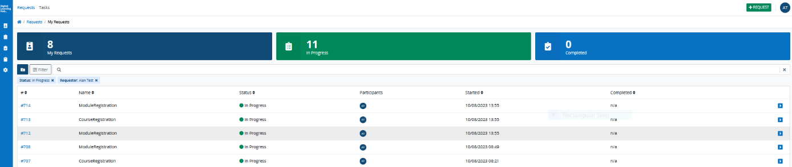
<!-- 1.5.3 -->
#### Tasks view

Displays the list of your Tasks To Do. Tasks are displayed as clickable links which open the relevant forms. 

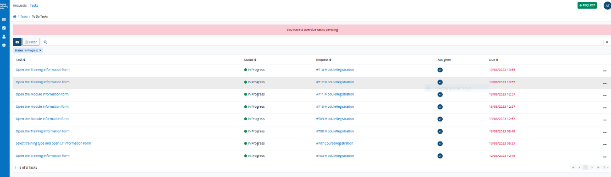
<!-- 1.5.4 -->
#### Filters

The above views can be filtered by type of Request, Task, and Status. 

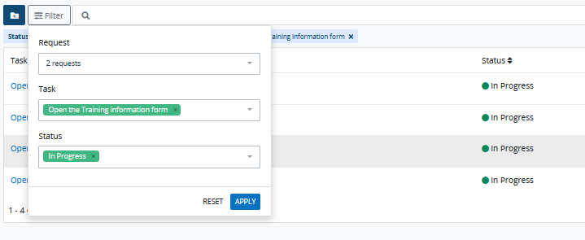

<!-- 1.6 -->
## Interface: Forms

1.	Select training type form
2.	Training Information form
3.	Learning Track Information form
4.	Corrections form 

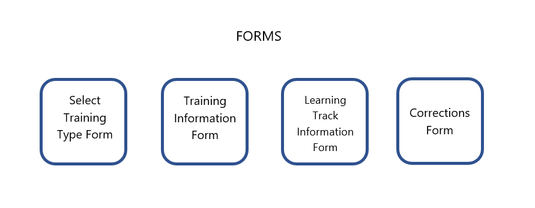

<!-- 1.6.1 -->
### Form 1

When the Select Training Type Form opens, select “Single training” and click the “Next” button. This brings you to the Training Information Form. 

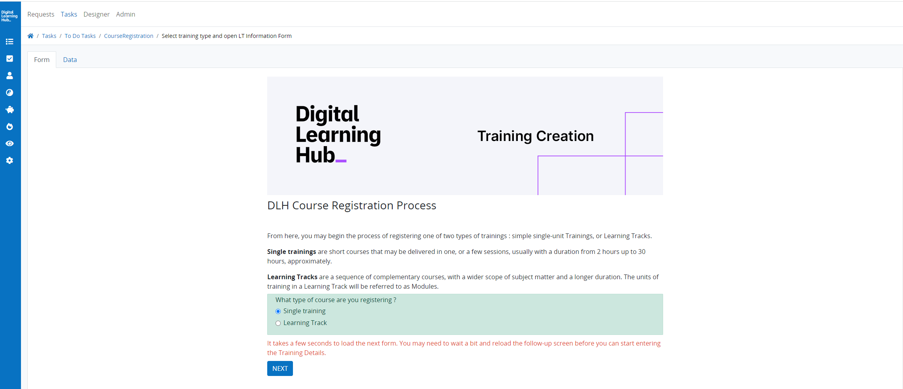

<!-- 1.6.2 -->
### Form 2 Overview

**WARNING MAKE RED** You may not save data in the forms within a task-in-progress. When you exit from a Task before completing it, your forms are reset. Thus, when you relaunch the Task, you must begin the Task again from scratch. 

<!-- 1.6.3 -->
#### Form 2 Detail

<!-- 1.6.3.1 -->
#### Screen 1: General training information

Tables

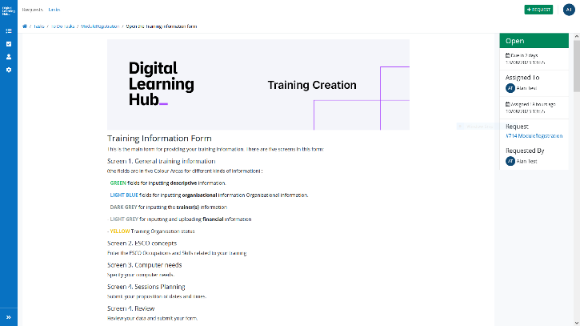
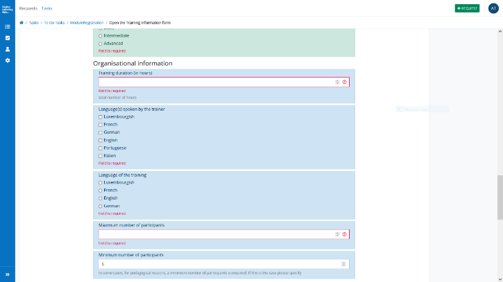
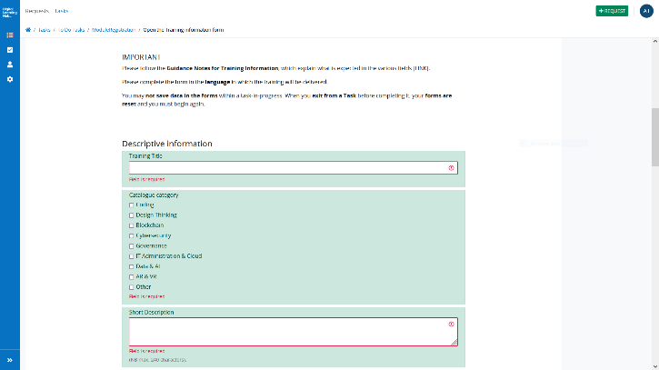
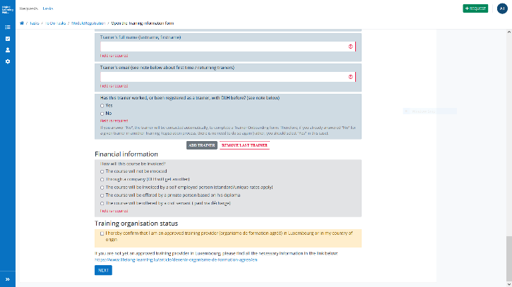

<!-- 1.6.3.2 -->
#### Screen 2: ESCO Concepts

1.	Occupations. Add the ESCO occupations concepts relevant for your training.
2.	Skills. Add the ESCO skills concepts relevant for your training.
3.	Prerequisites. Add ESCO skills concepts as pre-requisites for your training.

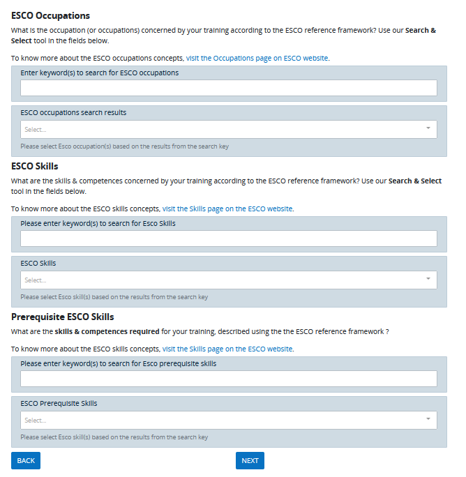

<!-- 1.6.3.3 -->
#### Screen 3: Computer needs

indicate your computer needs.

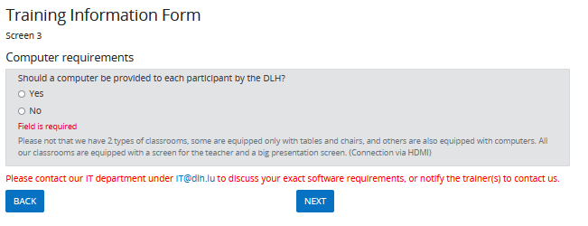

<!-- 1.6.3.4 -->
#### Screen 4: Session planning

Propose dates and times for your training.

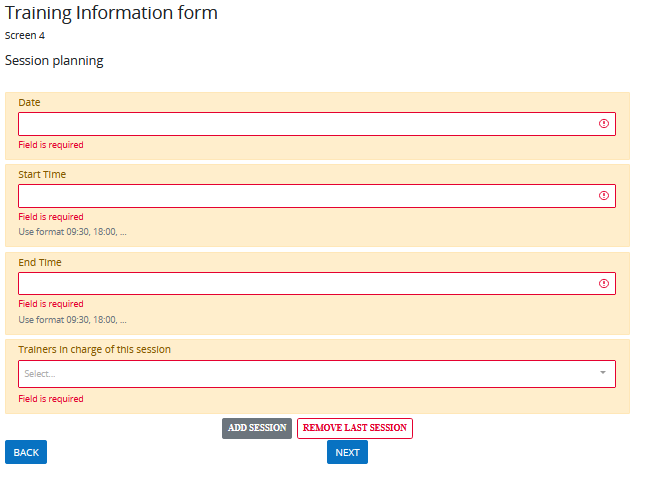

<!-- 1.6.3.5 -->
#### Screen 5: Review, Additional Information, and Submit

1.	Review screen to check your data before submitting
2.  Additional Information from DLH about
- 	Virtual machines
- 	Moodle (online learning platform)
- 	Paper-free office
3. Final comments or requirements: specify anything you need that is not considered elsewhere in the form
 
4. Participant training evaluation agreement
   
“In order to monitor and improve the quality of our training offer, we would like you to integrate a 5 minutes slot to give the participants the opportunity to evaluate the training. The link and QR Code, which you can integrate in your training presentation, will be sent to you by email from the DLH Training Administration Team. 

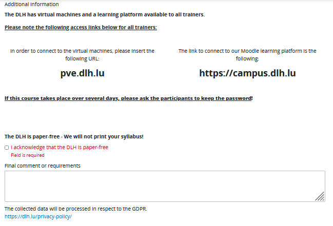
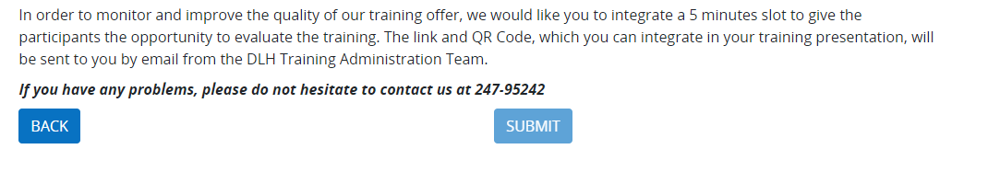

<!-- 1.6.4  -->
### Form 3

When the Select Training Type Form opens, select “Learning Track” and click the “Next” button. This brings you to the Learning Track Information Form.  

1.	Title
2.	Description
3.	Learning Outcomes
4.	Modules
5.	Modules previously registered (y/n)
6.	Training organisation status
7.	Additional info 

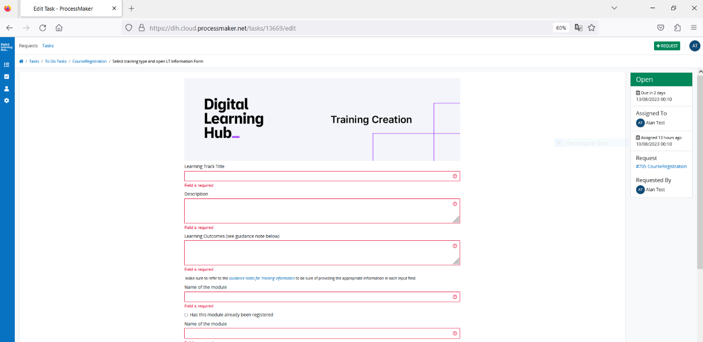
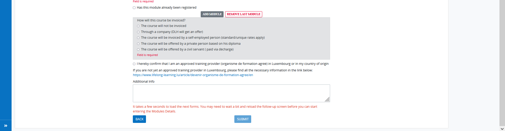

<!-- 1.6.5 -->
### Form 4

The corrections form contains only the specific fields that need to be revised. 

<!-- 2.0 -->
# Part 2. Using the TRS

<!-- 2.1 -->
## 2.1 Create and account and connect

Email. You receive an email with the link to reach the DLH Training Registration Platform. Follow the link to the Anonymous Web Entry page.

Account Creation Page. Fill in your chosen User Credentials (user name and password) to create your account. It is recommended to note the User Name and Password you enter here, before submitting, and make sure to keep a record of these. 

<!--  -->
## 2.2 Create a training
<!-- steps below -->

<!--2.2.1 -->
### Launch a training registration Request

Login Page. Login with your User Credentials.

New users (first connection). The first time you login, the system automatically directs you to a Training Type Form, where you select from “Learning Track” and “Single Training”. The appropriate Request is then created and you are directed to the Request view, where you see the Tasks associated with your Request.

Other users. Existing users land on the Dashboard screen. The Dashboard displays a summary of your requests in three coloured areas : My Requests (dark blue), In Progress (green), Completed (light blue).

Open the New Request widget. To launch a request, click on the green “+Request” button in the top-right corner of the screen.  

New Request. A popup widget will open and you click the blue “Start” button to launch a Request process for your training.

To register a Learning track, start a CourseRegistration request.

To register a Single Training, start a ModuleRegistration request. 

<!-- 2.2.2  -->
### Create a Single Training

In the Dashboard view, open the New Request Widget by clicking on green “+Request” button in the top right of the screen. Start a ModuleRegistration request to register a Single Training.

You are redirected to the Requests Screen, where you see your Tasks To Do. Click on “Open Training Information Form” to provide information about your course and register your training. 

If the task does not appear right away, we recommend reloading the page. Below is how the task should appear:

<!-- 2.2.3 -->
### Create a Learning Track

You click on Start to launch the CourseRegistration Request process. You are redirected to a new screen.

Request screen. Here, you see the Tasks associated with your current request. 

Request ID : Note that the identifier for your request is displayed in the path for the current view, like so :  Home / Requests / CourseRegistration #700 

Tasks. Click on “Select training type and Open LT Information Form”. This brings you to the Training Type Form. Select “Learning track” and click submit. You are redirected to Form 3. 

**MAKE RED** If the task does not appear right away, we recommend reloading the page.

<!-- 2.2.4 -->
#### Form 3 - Learning Track Information form.

The input fields allow you to provide the first level of information about the Learning Track (Title, Description, Learning Outcomes) and the Titles of the Modules that will be contained within the track. 

When you submit your form, you are redirected to the Requests Screen. Here, as well as your CourseRegistration Request, you now see a ModuleRegistration Request for each Module that you named (in the Learning Track Information Form).

Each Request is assigned a unique identifier. Thus, for the Learning Track created by the CourseRegistration request #707, the three modules we named have the identifiers #709, #710, and #711. If the ModuleRegistration requests do not appear right away, we recommend reloading the page. 

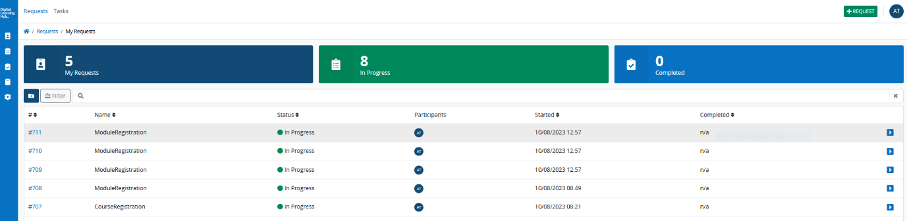

You may now open the **Training Information Forms** (Form 2) for the Modules of your Learning Track, by clicking on the appropriate *ModuleRegistration* request. 

p warning

You may **not save data** in the forms within a task-in-progress. When you exit from a Task before completing it, your **forms are reset**. Thus, when you relaunch the Task, you must begin the Task again from scratch.  

<!-- 2.3 -->
## Response: follow-up by the DLH. 

<!-- 2.3.1 -->
### Email

Some email processes are automated, and others are still done manually.

You will receive an automated email when you have submitted your form.

You will receive an automated email when your Training Registration Request has been reviewed by the DLH and if any changes need to be made.

You will receive an automated email when a new trainer needs to be onboarded. The trainer is asked to fill in a form.

You will receive an email by a member of the DLH Training Administration Team when your training registration has been approved. 

<!-- 2.3.2 -->
### Corrections

You may be asked to make changes in your forms. You will be notified by an automated email, which includes a link to access a Corrections Form. This link is also available as Tasks in your Tasks View (“Open Corrections Form”).

<!-- 2.3.3 -->
### 2.3.3 Request approved

When your training is approved by the DLH, it will be published in the DLH Catalogue, and you will receive a confirmation email from the DLH Training Administration Team, with a link to your published course. Part 3. Guidance Notes for providing general training information

<!-- 3.0 -->
# Part 3. Guidance notes

The content you provide is intended to be published as such in the DLH catalogue on our website. Therefore, we kindly ask that you follow these guidelines for providing training information. 

<!-- 3.1 -->
## Guidance for providing general training information

### Title

The title of the training

### Short description

A brief summary in one or two sentences, which includes the key terms from the full training description. (Max. 240 characters) 

### Full description

A text of one or two paragraphs which introduces some, or all, of the following points about the training: 

- Context, relevance, and interest 
- Subject and course contents
- Aims & goals 

### Contents

A list of topics in the training. Please provide only a simple list i.e., a one-dimensional list, or the main subjects and topics that make up the contents of the course. 

### Training method

Describes the pedagogical approach and training method. May include descriptions of the course materials, classroom activities, and (where relevant) products and outputs. 

### Learning outcomes

Leaning outcomes are statements of what a learner knows, understands, and is able to do on completion of a learning process, defined in terms of knowledge, skills, and competences. They describe how the learner can demonstrate the acquired knowledge, skill, or competence.

It is recommended to have between four and six learning outcomes per unit (or session) of a single training / module. In general, effective learning outcome descriptions should do the following:

-	Be preceded with a clear statement such as: on successful completion of this course, learners will be able to ...
-	Begin with an action verb and describe something (knowledge, skills or competence) that can be observed or measured.
-	Use one verb for each learning outcome.
-	Focus on what learners are expected to be able to demonstrate upon completion of the module/unit/learning activity.
-	Be written in clear short sentences. 
-	Be written so as to be understood by learners, different trainers or partners, or external bodies.
-	Try to avoid overuse of knowledge- and comprehension-based verbs (seek to include outcomes based on application, analysis and evaluation).
-	Match the scope of the course, so as to be neither too broad nor too specific. Broad would be at the Learning Track level, whereas specific would be for single training courses and modules (of a learning track).

### Prerequisites and recommendations

Prerequisites are knowledge, skills, or competences that are necessary for successfully participating in the training. Prerequisites should be specified where relevant.

Where there are no prerequisites, it is not needed to mention anything. Optionally, you may mention recommendations and provide guidance for learner’s expectations and preparations for the training.

### Level

The level indicates where the content of the training is situated on a scale of proficiency within the field of application of the subject of the training: beginner, intermediate, advanced. 

<!-- 3.2 -->
## Guidance for including ESCO concepts

### About ESCO concepts

[European Skills, Competences, Qualifications and Occupations (ESCO)](https://esco.ec.europa.eu/en)

ESCO concepts and descriptions can help leverage the outcomes of training and learning experiences in a number of ways that align with the DLH's mission to narrow the digital skills gap, namely by: 

- helping people to understand what knowledge, skills and competences are obtained as a result of a training
- contributing to facilitating the transition to the digital labour market by making digital tools communicate and work better together 

For this purpose, we ask that you reference your training with terms from two ESCO concept areas : occupations and skills. 

To learn more about ESCO, [visit the ESCO website](https://esco.ec.europa.eu/en)

### Search & Select tool 

For each section, ESCO Occupations and ESCO Skills, you can use the Search & Select tool : 

1. Enter your search term(s) / keywords in the first input field

2. See the results loaded as a list in the second input field, where you can select the appropriate ESCO occupation or skill concept. 

You may enter multiple search terms in the first field. The list in the second field will include the results related to all the terms you entered, and you can then select the appropriate ones by clicking on them.

#### ESCO occupations

Which occupation(s) is/are concerned by your training according to the ESCO reference framework? Use our Search & Select tool in the fields below.

To know more about the ESCO occupations concepts, [visit the Occupations page on ESCO website](https://esco.ec.europa.eu/en/classification/occupation_main).

#### ESCO skills

What are the skills & competences concerned by your training according to the ESCO reference framework? Use the **Search & Select** tool in the fields provided.  

To know more about the ESCO skills concepts, [visit the Skills page on the ESCO website](https://esco.ec.europa.eu/en/classification/skill_main).

#### Including ESCO skills as prerequisites

What are the **skills & competences** required for your training, described using the ESCO reference framework? 

To know more about the ESCO skills concepts, [visit the Skills page on the ESCO website](https://esco.ec.europa.eu/en/classification/skill_main).

